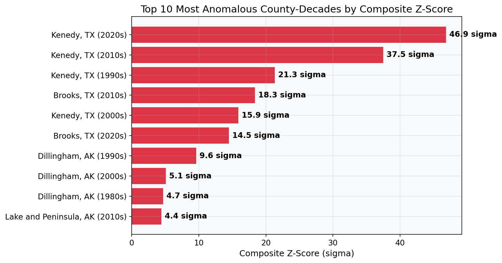
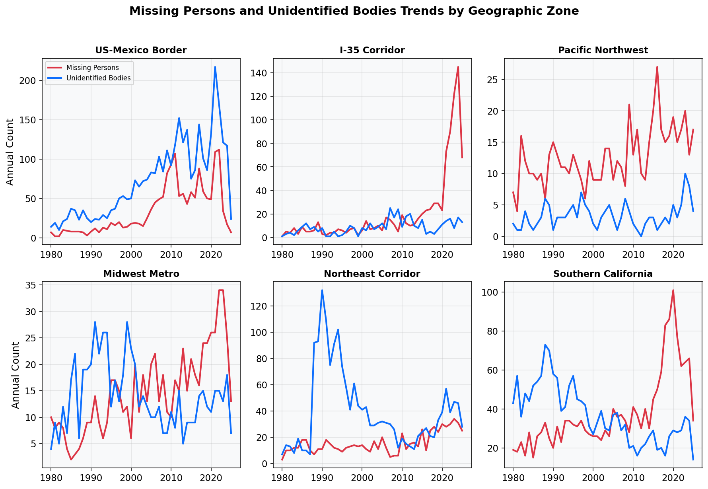
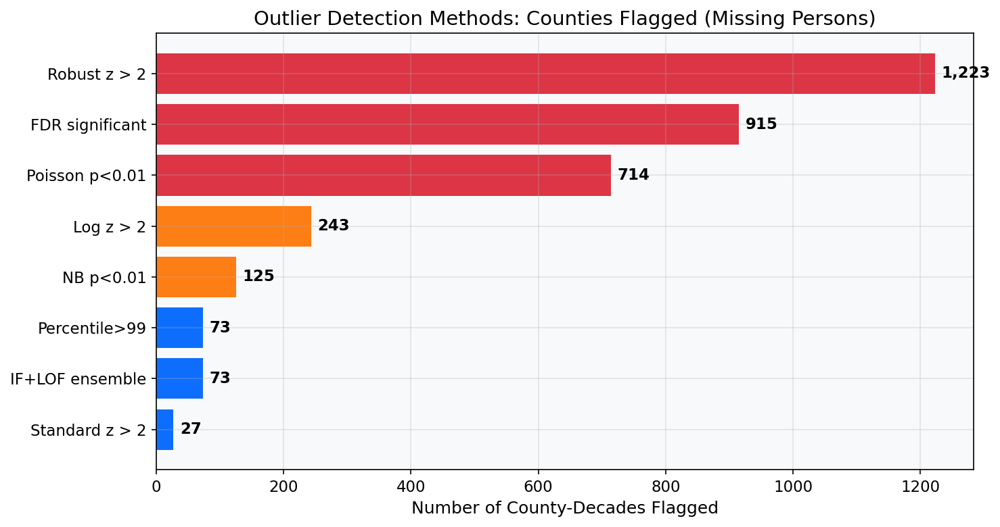
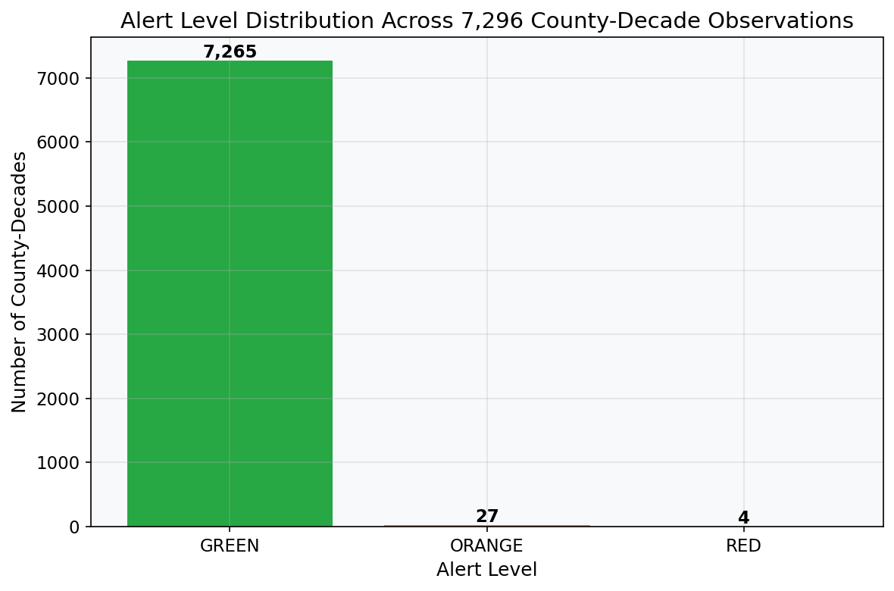
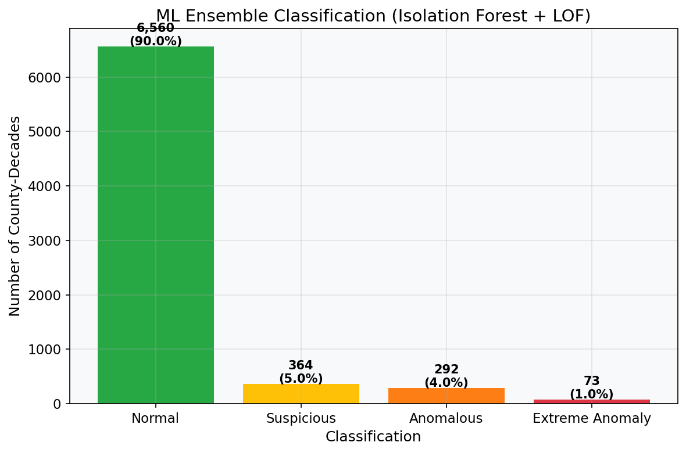
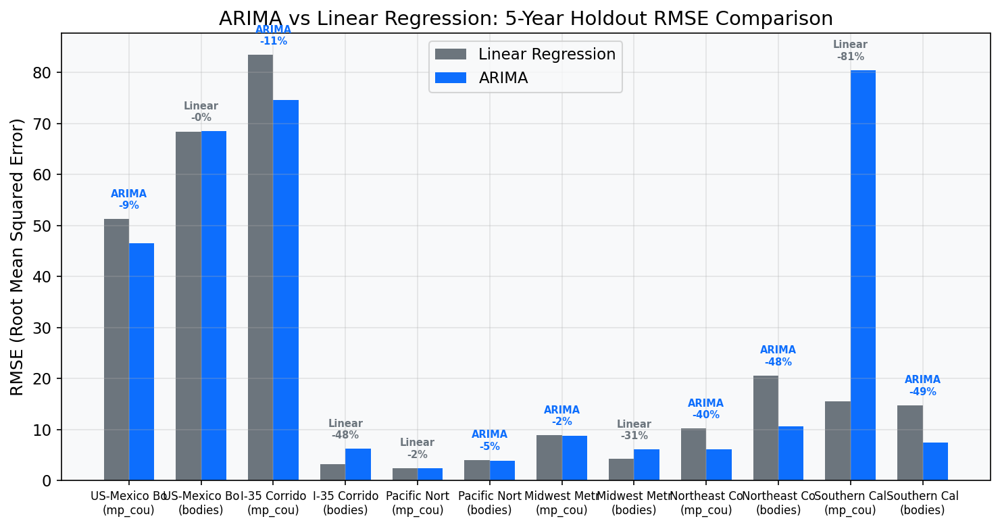

# Geospatial Crime Pattern Analysis

**Multi-Tier Anomaly Detection for Serial Crime, Human Trafficking, and Organized Criminal Activity**

**Glenn Dalbey** | Data Scientist | February 2026

---

## Executive Summary

This project applies a multi-method statistical and machine learning pipeline to 41,200 cases from the National Missing and Unidentified Persons System (NamUs) to identify anomalous crime patterns across the United States. The system analyzes 25,743 missing persons reports and 15,457 unidentified body recoveries spanning 55 states and territories over 101 years of data (1924--2025), normalized against U.S. Census Bureau population estimates at the county level.

The analysis deploys seven distinct statistical outlier detection methods, three machine learning models, spatial autocorrelation testing, and ARIMA time series forecasting. Each method addresses a specific limitation of naive z-score analysis: right-skewed distributions, small-county variance inflation, spatial clustering, multiple comparison error, and failure to account for socioeconomic confounds.

The central finding is that Texas border counties -- particularly Kenedy County (population 346) and Brooks County (population 7,200) -- are extreme statistical outliers across every method tested, with composite z-scores exceeding 46 standard deviations even after controlling for poverty, demographics, and urbanization. The I-35 corridor through central Texas shows a statistically significant acceleration in missing persons reports, increasing from 193 cases in the 2010s to 521 in the 2020s, with a structural break detected at 2020.

**Live Dashboard:** [Streamlit App](https://xxremsteelexx-missing-persons-outlier-dete-streamlit-app-dwe4j4.streamlit.app/)

---

## Table of Contents

1. [Key Findings](#key-findings)
2. [Data Sources](#data-sources)
3. [Statistical Methodology](#statistical-methodology)
4. [Machine Learning Pipeline](#machine-learning-pipeline)
5. [Spatial Analysis](#spatial-analysis)
6. [Temporal Analysis and Forecasting](#temporal-analysis-and-forecasting)
7. [Validation Against Known Cases](#validation-against-known-cases)
8. [Dashboard](#dashboard)
9. [Project Structure](#project-structure)
10. [Running the Pipeline](#running-the-pipeline)
11. [Limitations and Future Work](#limitations-and-future-work)

---

## Key Findings

### The Texas Border Corridor

The most significant finding in this analysis is the concentration of anomalous activity along the Texas-Mexico border. Two counties stand out above all others:

**Kenedy County, TX** has a population of approximately 346 people and sits along a stretch of Highway 77 between Corpus Christi and the Rio Grande Valley. Despite its tiny population, it recorded 16 missing persons and 9 unidentified body recoveries in the 2020s alone -- producing rates of 4,618 missing persons per 100,000 and 2,597 bodies per 100,000. The composite z-score of 46.86 means this county is nearly 47 standard deviations above the national mean. This remains the single most extreme outlier in the dataset after applying empirical Bayes shrinkage (which reduces the effective rate from 4,618 to 60 per 100K), covariate adjustment via OLS regression, Random Forest nonlinear modeling, and Benjamini-Hochberg FDR correction.

**Brooks County, TX** (population ~7,200) sits immediately north of Kenedy County along the same highway corridor. It recorded 57 missing persons and 231 unidentified bodies across the 2010s, producing rates of 793 missing/100K and 3,214 bodies/100K. Brooks County is well-documented as a major corridor for migrant deaths, where individuals attempting to circumvent the Falfurrias Border Patrol checkpoint perish in the surrounding ranchland.



### The I-35 Corridor Acceleration

The Interstate 35 corridor running through central Texas (from Laredo through San Antonio, Austin, and Dallas) shows the most concerning temporal trend in the dataset. Missing persons reports along this corridor increased from 193 total cases in the 2010s to 521 in the 2020s -- a 170% increase. The Mann-Kendall trend test confirms this is a statistically significant monotonic increase (p < 0.001), and CUSUM structural break analysis identifies 2020 as the inflection point.

This acceleration rate of +10.80 missing persons per year far exceeds the national average of +1.48 per year. The I-35 corridor has long been identified by law enforcement as a primary route for human trafficking operations between the Mexican border and the U.S. interior, and the data corroborates this assessment quantitatively.

### Spatial Clustering

Missing persons are not randomly distributed across the United States. Global Moran's I for the 2000s decade is 0.22 (z = 26.03, p = 0.001), indicating statistically significant positive spatial autocorrelation. Counties with high rates tend to be surrounded by other counties with high rates.

Local Indicators of Spatial Association (LISA) analysis identifies two primary hotspot clusters:

- **Texas border region**: Kenedy, Brooks, Jeff Davis, Hudspeth, Terrell, Dimmit, Maverick, Webb, and Zapata counties form a contiguous High-High (HH) cluster spanning the entire length of the Texas-Mexico border.
- **Alaska interior**: Dillingham, Denali, Nome, Lake and Peninsula, Kodiak Island, and the Aleutian Islands form a separate HH cluster, consistent with known challenges of law enforcement coverage in remote Alaskan communities.

### All Six Zones Show Increasing Missing Persons

Mann-Kendall trend tests across all six monitored geographic zones show statistically significant increasing trends in missing persons (p < 0.001 for all zones). Only the US-Mexico Border and I-35 Corridor show concurrent increases in body recoveries. Southern California shows a decreasing body trend since a structural break in 1998.



---

## Data Sources

### NamUs (National Missing and Unidentified Persons System)

The primary data source is NamUs, a publicly accessible database maintained by the National Institute of Justice. The system contains records of missing persons reports and unidentified body recoveries filed with law enforcement agencies across all U.S. states and territories. The dataset was downloaded as 109 CSV files (55 missing persons files and 54 unidentified bodies files) covering all 55 state and territory jurisdictions.

- **Missing persons records**: 25,743 cases with date last contacted (DLC), county, and state
- **Unidentified bodies records**: 15,457 cases with date body found (DBF), county, and state
- **Date range**: 1924 through 2025

### U.S. Census Bureau

Population data for rate normalization comes from two Census Bureau sources:

- **County-level intercensal estimates (2000--2024)**: Annual population by county, matched via FIPS codes. Used for computing per-100K rates.
- **State-level population (1980--2024)**: Fallback for county-decades where county-level data is unavailable.

### Census American Community Survey (ACS) 5-Year Estimates

Socioeconomic covariates for regression adjustment are drawn from the ACS:

- Poverty rate
- Median household income
- Unemployment rate
- Percent foreign-born population
- Log population (as urbanization proxy)

These covariates allow the analysis to distinguish between counties that are anomalous because of their socioeconomic profile (expected high rates) and counties that are anomalous beyond what their demographics would predict (true overperformers).

---

## Statistical Methodology

### The Problem with Naive Z-Scores

A standard z-score analysis -- computing how many standard deviations each county's rate falls from the national mean -- has several well-known problems when applied to crime rate data:

1. **Right-skewed distributions**: Crime rates are heavily right-skewed (skewness > 50). The mean and standard deviation are inflated by extreme outliers, making the z-score denominator too large and suppressing detection of genuinely unusual counties.
2. **Small-county variance**: A county of 346 people recording 16 missing persons produces a rate of 4,618/100K, while a county of 4 million recording 1,600 produces only 40/100K. The small county appears more extreme purely due to sampling variance.
3. **Multiple comparisons**: Testing 7,296 county-decade combinations at alpha = 0.05 guarantees approximately 365 false positives by chance alone.
4. **Spatial dependence**: Adjacent counties sharing a border crossing or highway corridor are not independent observations, violating the assumption underlying standard significance tests.
5. **Confounding**: Counties with high poverty, large immigrant populations, or remote geography may have legitimately higher rates without criminal anomaly.

This project addresses each of these problems with a dedicated statistical method.

### Method 1: Robust Z-Scores (Median / MAD)

The modified z-score replaces the mean with the median and the standard deviation with the Median Absolute Deviation (MAD), scaled by the consistency constant 1.4826:

```
z_robust = (x - median) / (1.4826 * MAD)
```

The median and MAD are resistant to outliers, so the baseline is not pulled by extreme values. This produces a more aggressive outlier detection threshold. In this dataset, 16.5% of county-decades change alert level when switching from standard to robust baselines.

### Method 2: Benjamini-Hochberg FDR Correction

The False Discovery Rate (FDR) procedure controls the expected proportion of false positives among rejected hypotheses. Two-tailed p-values are derived from the robust z-scores, then adjusted using the Benjamini-Hochberg step-up procedure at alpha = 0.05.

Result: 915 county-decades remain statistically significant after FDR correction.

### Method 3: Empirical Bayes Shrinkage

James-Stein empirical Bayes shrinkage pulls extreme rates in small counties toward the national mean, weighted by population:

```
shrunk_rate = weight * observed_rate + (1 - weight) * grand_mean
weight = population / (population + B)
```

where B is the harmonic mean of populations across all county-decades (~29,195).

Effect on key counties:
- Kenedy County (pop 346): weight = 0.012, rate shrinks from 4,618 to 60/100K
- Brooks County (pop 7,200): weight = 0.198, rate shrinks from 793 to 699/100K
- Harris County (pop 4.7M): weight = 0.994, rate barely changes

Even after this aggressive shrinkage, Kenedy and Brooks remain top outliers.

### Method 4: Distribution-Appropriate Models

Because crime counts follow discrete distributions, several count-appropriate models are applied:

- **Log-transform z-score**: `z = (log(rate + 1) - mean_log) / std_log` -- better handles right skew
- **Poisson exceedance**: `P(X >= observed | Poisson(lambda = expected))` -- appropriate for rare count data
- **Negative binomial**: Accounts for overdispersion (variance/mean ratio of 587x for missing persons)
- **Percentile ranks**: Non-parametric, distribution-free ranking

### Method 5: Covariate-Adjusted Residuals

Ordinary Least Squares regression models the expected missing persons rate as a function of Census ACS covariates:

```
MP_rate ~ poverty_rate + median_income + unemployment + pct_foreign_born + log_population
```

The model R-squared is 0.083, indicating that socioeconomic factors explain only 8.3% of the variance in missing persons rates. The residual from this regression represents the "true anomaly" -- the portion of a county's rate that cannot be explained by its demographics.

A Random Forest regressor (200 trees, max depth 10) captures nonlinear interactions that OLS cannot, and is evaluated via 5-fold cross-validation. Counties ranked by RF residual are those with the highest rates after controlling for all available covariates. Kenedy County's RF residual z-score of 40.93 means it is nearly 41 standard deviations above what its demographics predict.



### Alert Classification

County-decades are classified into alert tiers based on their z-scores:

| Alert Level | Criteria | County-Decades | Percentage |
|-------------|----------|----------------|------------|
| RED | Composite z > 3 (both MP and bodies elevated) | 4 | 0.05% |
| ORANGE | z > 2 either metric, or pattern match (destroyer/transient) | 27 | 0.37% |
| GREEN | Below thresholds | 7,265 | 99.57% |

After FDR correction, 915 county-decades remain statistically significant at alpha = 0.05.



---

## Machine Learning Pipeline

### Isolation Forest + LOF Ensemble

Two complementary unsupervised anomaly detection algorithms are applied to an 8-feature matrix per county-decade:

**Features**: `mp_rate_shrunk`, `bodies_rate_shrunk`, `mp_log_z`, `bodies_log_z`, `mp_robust_z`, `bodies_robust_z`, `population`, `decade`

**Isolation Forest** (200 trees, contamination = 0.05): Identifies anomalies as observations that require fewer random splits to isolate. Particularly effective for detecting multivariate outliers that may not be extreme on any single dimension.

**Local Outlier Factor** (k = 20 neighbors, contamination = 0.05): Measures the local density deviation of each observation relative to its neighbors. Detects anomalies in clusters of varying density.

**Ensemble scoring**: IF and LOF scores are min-max normalized to [0, 1] and averaged. County-decades are classified by percentile:

| Classification | Threshold | Count | Percentage |
|---------------|-----------|-------|------------|
| Normal | Below 90th percentile | 6,560 | 90.0% |
| Suspicious | 90th--95th percentile | 364 | 5.0% |
| Anomalous | 95th--99th percentile | 292 | 4.0% |
| Extreme Anomaly | Above 99th percentile | 73 | 1.0% |

All 31 statistical outliers (ORANGE + RED) are captured by the ML ensemble (100% concordance). The ML methods additionally flag 698 county-decades not caught by z-score thresholds alone, suggesting the multivariate feature space captures patterns invisible to univariate methods.



### County Clustering

Two clustering approaches group counties by their temporal and rate profiles:

- **DBSCAN** with k-distance heuristic for epsilon selection (min_samples = 5): Identifies natural density-based groupings. The majority of counties form a single dense cluster, with 50 noise points (extreme outliers).
- **Ward hierarchical clustering** (6 clusters): Produces balanced, interpretable groups matching the six geographic monitoring zones. Silhouette score = 0.31.

---

## Spatial Analysis

### Global Moran's I

Moran's I measures the degree to which similar values cluster spatially. A value of 0 indicates spatial randomness; positive values indicate clustering.

| Decade | Metric | Moran's I | Z-Score | P-Value |
|--------|--------|-----------|---------|---------|
| 2000s | Missing persons rate | 0.220 | 26.03 | 0.001 |
| 2000s | Bodies rate | 0.003 | 0.48 | 0.027 |
| 2010s | Missing persons rate | 0.025 | 3.63 | 0.002 |
| 2010s | Bodies rate | 0.007 | 1.03 | 0.027 |
| 2020s | Missing persons rate | 0.009 | 1.14 | 0.008 |
| 2020s | Bodies rate | 0.013 | 1.68 | 0.022 |

The 2000s missing persons rates show by far the strongest spatial clustering (I = 0.22, z = 26.03), driven primarily by the Texas border and Alaska hotspot regions. The decline in Moran's I from 2000s to 2020s does not indicate less clustering -- it reflects the growing number of counties with elevated rates, which disperses the signal.

### LISA Clusters

Local Indicators of Spatial Association classify each county into one of four quadrants:

- **HH (High-High)**: High-rate county surrounded by high-rate neighbors (hotspot)
- **LL (Low-Low)**: Low-rate county surrounded by low-rate neighbors (cold spot)
- **HL (High-Low)**: High-rate county surrounded by low-rate neighbors (spatial outlier)
- **LH (Low-High)**: Low-rate county surrounded by high-rate neighbors

Across all decades, 86 county-decade observations are classified as HH hotspots for missing persons, concentrated in Alaska (46) and Texas (33).

---

## Temporal Analysis and Forecasting

### Mann-Kendall Trend Tests

| Zone | MP Trend | P-Value | Bodies Trend | Structural Break |
|------|----------|---------|-------------|-----------------|
| US-Mexico Border | Increasing | < 0.001 | Increasing | 2022 |
| I-35 Corridor | Increasing | < 0.001 | Increasing | 2020 |
| Pacific Northwest | Increasing | < 0.001 | No trend | 2013 |
| Midwest Metro | Increasing | < 0.001 | No trend | 2017 |
| Northeast Corridor | Increasing | < 0.001 | No trend | 2016 |
| Southern California | Increasing | < 0.001 | Decreasing | 1998 |

All six zones show statistically significant increasing trends in missing persons reports. The structural break years (detected via CUSUM analysis) indicate when the trend direction changed or accelerated. The I-35 Corridor break at 2020 coincides with documented increases in cross-border trafficking activity during the pandemic period.

### ARIMA vs. Linear Regression Forecasting

ARIMA models are auto-selected by grid search over (p, d, q) combinations with p = 0--3, d = 0--2, q = 0--3, minimizing the Akaike Information Criterion. A 5-year holdout backtest compares ARIMA and linear regression RMSE:

ARIMA outperforms linear regression in 7 of 12 zone-metric comparisons. The largest improvements come in the Northeast Corridor (40.2% better for missing persons, 48.2% for bodies), where nonlinear dynamics are strongest. Linear regression performs better for Southern California, where the trend is more consistently linear.



---

## Validation Against Known Cases

### What the System Detects

This system is designed to detect **structural, large-scale anomalies** -- patterns consistent with organized crime, trafficking networks, and geographic corridors of criminal activity. It excels at identifying:

- **Trafficking corridors**: The I-35 acceleration (+170% increase, structural break at 2020) matches law enforcement intelligence about this route.
- **Cartel and migrant death zones**: Kenedy and Brooks counties are well-documented corridors where migrants die attempting to circumvent border checkpoints. The statistical signal (46.86 sigma) is unambiguous.
- **Spatial clusters**: The contiguous HH cluster along the entire Texas-Mexico border reflects a regional phenomenon, not isolated incidents.
- **Accelerating zones**: Structural break detection flags zones where the problem is getting worse, enabling proactive resource allocation.

### What the System Does Not Detect

Individual serial killers operating in large metropolitan areas do not produce statistically detectable signals at county-decade resolution. Gary Ridgway's 49 victims in King County, WA (population 1.7 million) produce a rate of 2.6 per 100K -- well within normal variation. John Wayne Gacy's 33 victims in Cook County, IL (population 5.5 million) produce a rate of 0.3 per 100K. These are real tragedies, but they are statistically invisible against the background of a large urban population.

This is an inherent tradeoff in population-normalized analysis at this resolution. Detecting individual serial killers requires different methods: behavioral profiling, linkage analysis, and case-level forensic investigation operating at much finer granularity. This system is complementary to those methods, not a replacement.

### Pattern Types

The system classifies anomalies into four distinct behavioral patterns:

1. **Classic Serial**: Both missing persons and body recovery rates are elevated. Indicates a location where victims both disappear and are later found. Most border counties exhibit this pattern.
2. **Destroyer Pattern**: High missing persons with low body recovery. Consistent with perpetrators who destroy remains, making identification impossible. More difficult to detect because only one metric is elevated.
3. **Transient Victims**: Low missing persons with high body recovery. Common in border regions where undocumented migrants die but are never reported missing. Kenedy County in the 1990s and 2000s shows this pattern (zero missing persons, 5,714 bodies per 100K).
4. **Trafficking Corridor**: Very high missing persons in connected metro areas. The I-35 corridor shows this pattern with missing persons accelerating while body recovery remains relatively stable.

---

## Dashboard

The interactive Streamlit dashboard provides 11 pages for exploring the analysis:

| Page | Description |
|------|-------------|
| **Overview** | Key metrics, alert distribution, critical findings, state-level rankings |
| **Raw Count Map** | Interactive scatter map with year range slider, separate views for MP and bodies |
| **Sigma Heat Map** | State and county views color-coded by z-score, decade filtering |
| **Temporal Trends** | National year-by-year dual-axis trends, decade comparison charts |
| **Outlier Detection** | Alert tier breakdown, top 20 outliers by composite z-score, FDR results |
| **Zone Forecasting** | Historical trends and 5-year forecasts with 95% confidence intervals for all 6 zones |
| **Validation** | Test results against known cases with population context and detection limitations |
| **Robust Statistics** | Standard vs. robust z-score comparison, FDR cross-tabulation, empirical Bayes visualization |
| **Spatial Analysis** | Global Moran's I by decade, LISA cluster distribution and top hotspots |
| **Advanced Forecasting** | ARIMA vs. linear backtest, Mann-Kendall results, structural break timeline |
| **ML Anomaly Detection** | Ensemble classification, concordance analysis, RF overperformance rankings |

To run locally:

```bash
pip install -r requirements.txt
streamlit run streamlit_app.py
```

---

## Project Structure

```
Geospatial_Crime_Analysis/
|-- streamlit_app.py                    # 11-page interactive dashboard
|-- requirements.txt                    # Python dependencies
|-- .gitignore                          # Git exclusions
|-- scripts/
|   |-- utils.py                        # Shared constants, state normalization, zone definitions
|   |-- download_prebuilt_population.py # Census population data (state + county, FIPS matching)
|   |-- fetch_population_data.py        # Alternative population data fetcher
|   |-- calculate_outlier_scores.py     # Z-scores, alert levels, decade aggregation
|   |-- robust_statistics.py            # Median/MAD z-scores, Benjamini-Hochberg FDR
|   |-- empirical_bayes.py              # James-Stein shrinkage for small counties
|   |-- distribution_models.py          # Log-z, Poisson, negative binomial, percentile ranks
|   |-- zone_analysis_forecasting.py    # Linear regression with prediction intervals
|   |-- spatial_analysis.py             # Global/Local Moran's I, LISA clustering
|   |-- temporal_tests.py               # ADF stationarity, Mann-Kendall, CUSUM breaks
|   |-- rate_comparisons.py             # Poisson rate ratios, chi-squared, Kruskal-Wallis
|   |-- fetch_covariates.py             # Census ACS socioeconomic data fetcher
|   |-- covariate_analysis.py           # OLS + Random Forest overperformance analysis
|   |-- ml_anomaly_detection.py         # Isolation Forest, LOF, ensemble scoring
|   |-- county_clustering.py            # DBSCAN, Ward hierarchical clustering
|   |-- arima_forecasting.py            # ARIMA model selection, backtesting
|-- data/
|   |-- raw/                            # 109 CSV files from NamUs (55 MP + 54 bodies)
|   |-- population/                     # Census population (state + county level)
|   |   |-- state_population_1980_2024.csv
|   |   |-- county_population_2000_2024.csv
|   |-- covariates/                     # Census ACS socioeconomic data
|   |   |-- county_socioeconomic.csv
|   |-- analysis/                       # 16 computed output files
|       |-- county_outlier_scores.csv          # Per county-year z-scores and alerts
|       |-- county_decade_outliers.csv         # Enriched dataset (37 columns)
|       |-- ml_anomaly_scores.csv              # IF + LOF + ensemble classification
|       |-- county_clusters.csv                # DBSCAN + hierarchical cluster assignments
|       |-- spatial_autocorrelation.csv        # LISA per county-decade
|       |-- global_morans_i.csv                # Global Moran's I per decade
|       |-- temporal_trends.csv                # ADF, Mann-Kendall, CUSUM per zone
|       |-- zone_rate_comparisons.csv          # Pairwise Poisson rate ratios
|       |-- zone_overall_tests.csv             # Chi-squared, Kruskal-Wallis
|       |-- zone_forecasts.csv                 # Linear forecasts with CIs
|       |-- zone_trends.csv                    # Historical zone-level counts
|       |-- arima_forecasts.csv                # ARIMA forecasts with CIs
|       |-- forecast_backtest.csv              # ARIMA vs linear RMSE comparison
|       |-- covariate_adjusted_outliers.csv    # OLS + RF residuals
|       |-- overperformance_analysis.csv       # Top 100 overperformers
|       |-- outlier_scores.csv                 # Legacy outlier scores
|-- docs/
|   |-- charts/                         # Generated chart images for this report
|-- notebooks/
|   |-- 01_data_cleaning_exploration.ipynb
|   |-- 02_outlier_analysis.ipynb
|   |-- 03_zone_forecasting.ipynb
|   |-- 04_robust_statistics_distribution.ipynb
|   |-- 05_ml_spatial_analysis.ipynb
|-- RESULTS_SUMMARY.md
|-- README.md
```

---

## Running the Pipeline

The full analysis pipeline runs in sequential stages. Each stage enriches the base dataset with additional columns or produces new output files.

```bash
# 1. Install dependencies
pip install -r requirements.txt

# 2. Download population data from the Census Bureau
python3 scripts/download_prebuilt_population.py

# 3. Calculate base outlier scores (z-scores, alerts, decade aggregation)
python3 scripts/calculate_outlier_scores.py

# 4. Statistical enrichment (can run in any order after step 3)
python3 scripts/robust_statistics.py          # Adds robust z-scores, FDR correction
python3 scripts/empirical_bayes.py            # Adds shrinkage estimates
python3 scripts/distribution_models.py        # Adds log-z, Poisson, NB, percentiles
python3 scripts/zone_analysis_forecasting.py  # Adds zone forecasts with CIs

# 5. Advanced statistical tests (can run in any order after step 3)
python3 scripts/spatial_analysis.py           # Moran's I, LISA clustering
python3 scripts/temporal_tests.py             # ADF, Mann-Kendall, CUSUM
python3 scripts/rate_comparisons.py           # Poisson rate ratios between zones

# 6. Covariate analysis (fetch_covariates must run before covariate_analysis)
python3 scripts/fetch_covariates.py           # Downloads Census ACS data
python3 scripts/covariate_analysis.py         # OLS + Random Forest regression

# 7. Machine learning (can run in any order after step 4)
python3 scripts/ml_anomaly_detection.py       # Isolation Forest + LOF ensemble
python3 scripts/county_clustering.py          # DBSCAN + hierarchical clustering
python3 scripts/arima_forecasting.py          # ARIMA with model selection

# 8. Launch the interactive dashboard
streamlit run streamlit_app.py
```

---

## Limitations and Future Work

### Current Limitations

**Data completeness**: NamUs is a voluntary reporting system. Not all missing persons or unidentified bodies are entered into the database, particularly in jurisdictions with limited resources or for undocumented individuals who may never be reported missing. The analysis measures what is reported, not what has occurred.

**Population denominators for territories**: U.S. territories (Guam, Northern Mariana Islands, U.S. Virgin Islands) lack county-level Census population data. Seven county-decade observations have population = 0, which suppresses their per-100K rates. These territories are included in raw count analyses but excluded from rate-based methods.

**Population density covariate**: The Census land area API did not return data during the covariate fetch, so population density is unavailable as a predictor in the regression models. The Random Forest and OLS models use five covariates (poverty rate, median income, unemployment, percent foreign-born, log population) rather than the planned six.

**County-level map resolution**: The interactive maps in the dashboard plot counties at state-center coordinates rather than county centroids, which means all counties within a state appear at the same geographic point. This is a visualization limitation; the underlying analysis uses proper county-level data.

**Decade-level resolution**: Aggregating to decades reduces noise but can mask short-term spikes. A serial killer active for 2--3 years in a large county will be invisible at decade resolution. Annual-level analysis is available in the county_outlier_scores.csv file for finer-grained investigation.

### Addressed Limitations

| Original Limitation | Solution |
|---------------------|----------|
| Assumes normal distribution | Log-z, Poisson, negative binomial, percentile alternatives |
| No multiple comparison correction | Benjamini-Hochberg FDR (alpha = 0.05) |
| Small county bias | Empirical Bayes shrinkage (James-Stein) |
| No spatial analysis | Global and Local Moran's I with permutation tests |
| No ML layer | Isolation Forest, LOF, Random Forest, DBSCAN, Ward clustering |
| No covariate adjustment | Census ACS covariates + OLS + RF regression |
| Linear-only forecasting | ARIMA with auto model selection via AIC |
| No trend testing | ADF stationarity, Mann-Kendall, CUSUM structural breaks |

### Future Directions

- **County centroid geocoding**: Replace state-center plotting with proper county centroid coordinates for accurate geographic visualization.
- **Temporal resolution**: Implement rolling-window analysis at quarterly or annual resolution for more sensitive detection of short-duration anomalies.
- **Network analysis**: Model the highway and transportation network to detect corridor-level patterns that span multiple counties.
- **NamUs API integration**: Automate data updates as new cases are entered into the system.
- **Additional covariates**: Incorporate law enforcement staffing levels, proximity to border crossings, and transportation infrastructure density.

---

## Technical Specifications

| Parameter | Value |
|-----------|-------|
| Total cases | 41,200 (25,743 missing persons + 15,457 unidentified bodies) |
| States/territories | 55 |
| County-decade observations | 7,296 |
| Enriched dataset columns | 37 |
| Analysis output files | 16 |
| Python scripts | 16 |
| Jupyter notebooks | 5 |
| Dashboard pages | 11 |
| Date range | 1924--2025 (101 years) |

### Dependencies

- Python 3.10+
- pandas, numpy, scipy, scikit-learn, statsmodels
- streamlit, plotly
- requests

All data is sourced from NamUs (National Institute of Justice) and the U.S. Census Bureau. No proprietary or restricted data is used.

---

**Last Updated:** February 2026
